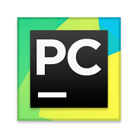

       Hi, I’m George
       

  
  
  
  
  ##  QA Engineer
  
- 🌱 I’m working now in TEDU (QA)

- 💞️ I’m currently learning QA Automation

 

## 💻 Technology stack

 

<
                          

<h2> Connect with me  </h2>

 

###

<!---
BrowserNeo/BrowserNeo is a ✨ special ✨ repository because its `README.md` (this file) appears on your GitHub profile.
You can click the Preview link to take a look at your changes.
--->

