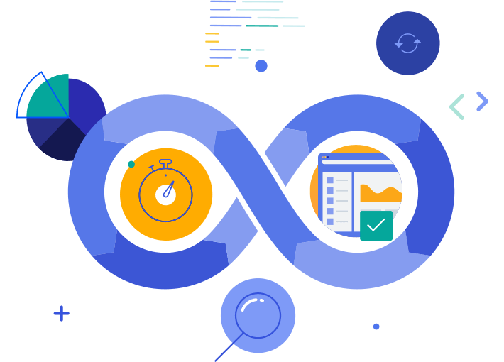
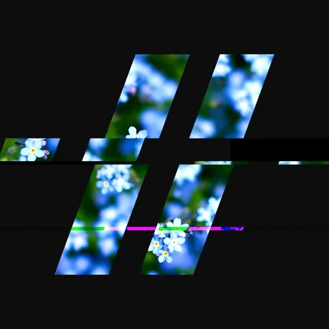
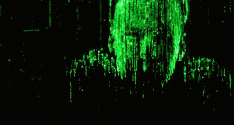

<h1></h1>

<h4 align="left">
╔═ 👀 𝕐&nbsp;𝕆&nbsp;𝕌&nbsp;ℝ&nbsp;&nbsp;𝕋&nbsp;ℍ&nbsp;𝔼&nbsp;𝕄&nbsp;𝔼&nbsp;&nbsp;𝕄&nbsp;𝕆&nbsp;𝔻&nbsp;𝔼 👀

     
╚═════ &nbsp;&nbsp;𝐈𝐓'𝐒 [𝐃𝐀𝐑𝐊⚫](https://github.com/settings/appearance#gh-dark-mode-only)[𝐁𝐑𝐈𝐆𝐇𝐓⚪](https://github.com/settings/appearance#gh-light-mode-only) 𝐈𝐍 𝐇𝐄𝐑𝐄... 
</h4>

<h5 align="right">
     

</h5>
<!--🪳ROACH&🕷️SPIDER--> 

&nbsp;&nbsp;&nbsp;&nbsp;&nbsp;&nbsp;&nbsp;&nbsp;&nbsp;&nbsp;&nbsp;&nbsp;&nbsp;&nbsp;&nbsp;&nbsp;&nbsp;&nbsp;&nbsp;&nbsp;&nbsp;&nbsp;&nbsp;&nbsp;&nbsp;&nbsp;&nbsp;&nbsp;&nbsp;&nbsp;&nbsp;&nbsp;&nbsp;&nbsp;&nbsp;&nbsp;&nbsp;&nbsp;&nbsp;&nbsp;&nbsp;&nbsp;&nbsp;&nbsp;&nbsp;&nbsp;&nbsp;&nbsp;&nbsp;&nbsp;&nbsp;&nbsp;&nbsp;&nbsp;&nbsp;&nbsp;&nbsp;&nbsp;&nbsp;&nbsp;&nbsp;&nbsp;&nbsp;&nbsp;&nbsp;&nbsp;&nbsp;&nbsp;&nbsp;&nbsp;&nbsp;&nbsp;&nbsp;&nbsp;&nbsp;&nbsp;&nbsp;&nbsp;&nbsp;&nbsp;&nbsp;&nbsp;&nbsp;&nbsp;&nbsp;&nbsp;&nbsp;&nbsp;&nbsp;&nbsp;&nbsp;&nbsp;&nbsp;&nbsp;&nbsp;&nbsp;&nbsp;&nbsp;&nbsp;&nbsp;&nbsp;&nbsp;&nbsp;&nbsp;&nbsp;&nbsp;&nbsp;&nbsp;&nbsp;&nbsp;&nbsp;&nbsp;
      

  
  
  
  
 

<!--🪳ROACH&🕷️SPIDER--> 
<h5 align="center">     

</h5>

<!--📏LINE-->

 
     
<!--🎨THEMEMODE / 🌐WEBSITE: https://fancytext.blogspot.com/ -->

     

     
- 💞️ My current focus is on learning ...

 

## 💻 Technology stack

 
<h2 align="center">
                              
 
 
</h2>

<h3 align="center"> Connect with me  </h3>
 
</h3>
<h3 align="center">
     

</h3>

###

<!---
BrowserNeo/BrowserNeo is a ✨ special ✨ repository because its `README.md` (this file) appears on your GitHub profile.
You can click the Preview link to take a look at your changes.
--->

 

<!--🐍💬SNAKETITLE / 🌐WEBSITE: https://textanim.com/ -->

 

<h4 align="center">

</h4>

 

<!--📏LINE-->

  
<!--🎨THEMEMODE / 🌐WEBSITE: https://fancytext.blogspot.com/ -->

 

<!--📏LINE-->

  
<!--🎨THEMEMODE / 🌐WEBSITE: https://fancytext.blogspot.com/ -->

 

 

    

     

    

    
   

    

    

 

2008 All rights reserved

 
